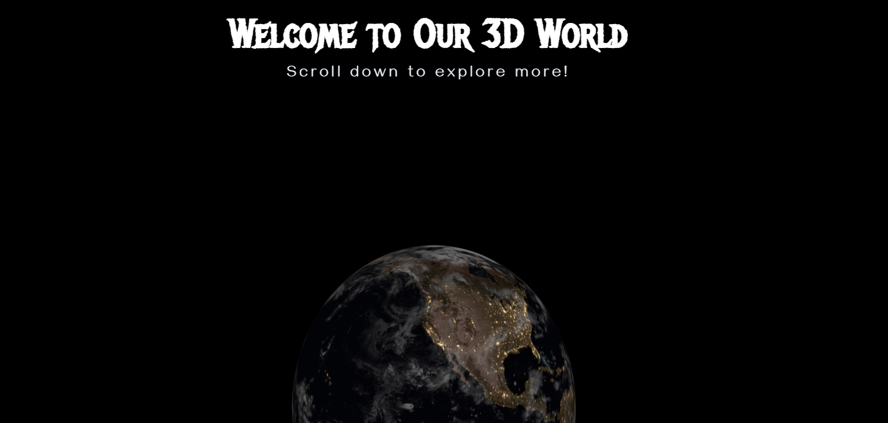
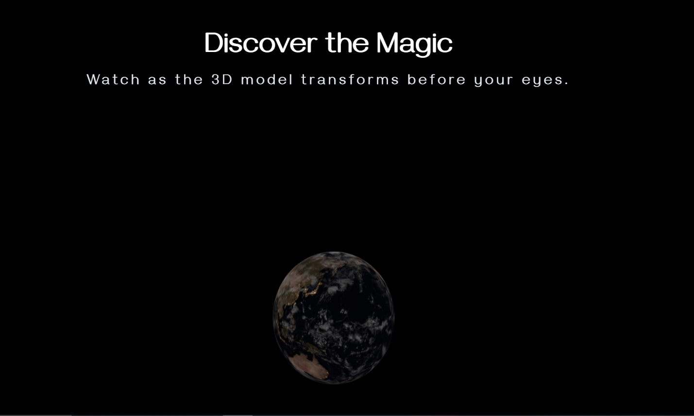
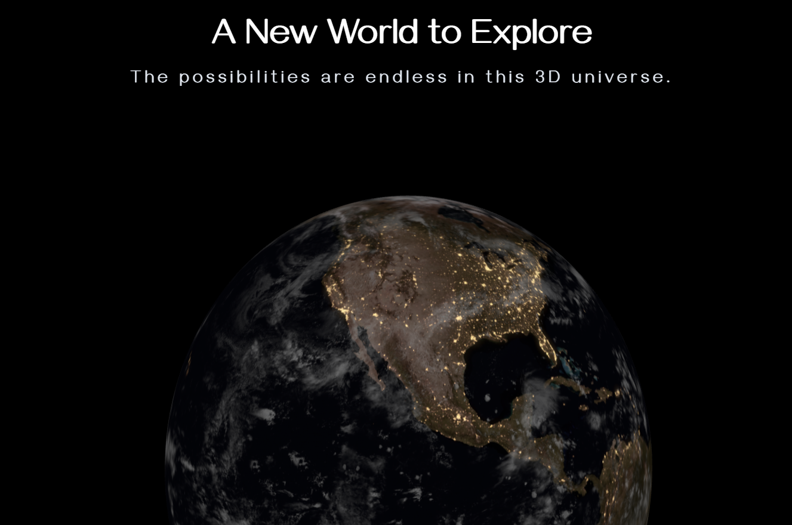

<h1 align="center">3D Scrolling Website</h1>

#

<table>
  <tr>
    <td colspan="2">
        
    </td>
  </tr>
  <tr>
    <td></td>
    <td></td>
  </tr>
</table>

This project is a dynamic 3D scrolling website that showcases an interactive Earth model using Three.js and GSAP for animations. As users scroll through the page, they experience a captivating journey with the 3D Earth model transforming and moving in response to their interactions.

## Features

- Interactive 3D Earth model
- Smooth scrolling animations
- Responsive design
- Dynamic text animations
- Continuous Earth rotation

## Technologies Used


## Setup and Installation

1. Clone the repository
2. Install dependencies:
   ```
   npm install
   ```
3. Run the development server:
   ```
   npm run dev
   ```
4. Open your browser and navigate to `http://localhost:3000` (or the port specified by Vite)

## Project Structure

- `index.html`: Main HTML file
- `main.js`: JavaScript file containing 3D scene setup and animations
- `style.css`: CSS styles (using Tailwind CSS)
- `public/assets/models/earth.glb`: 3D Earth model

## Contributing

Contributions, issues, and feature requests are welcome. Feel free to check issues page if you want to contribute.

## License

This project is licensed under the MIT License.
